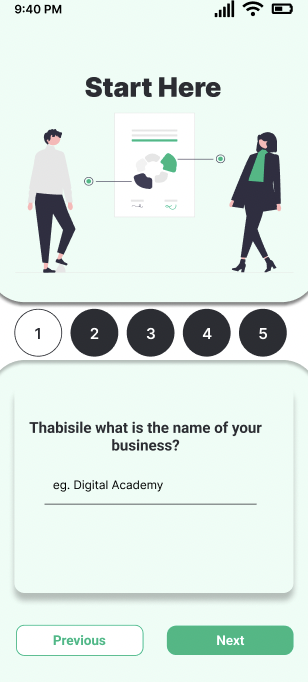

# RegiPro Web Application Documentation

RegiPro is a comprehensive web application that aims to support small businesses throughout their journey, providing assistance with business registration through CIPC (Companies Intellectual Property Commission), generating business plans using OpenAI, and recommending ABSA business products for funding. The application is divided into two main components: the frontend, built with Angular, and the backend, developed using Node.js, Express, and PostgreSQL. This documentation provides an overview of both the frontend and backend, along with installation instructions and usage details.

## Table of Contents

- [Frontend](#frontend)
  - [Introduction](#introduction)
  - [Features](#features)
  - [Installation](#installation)
  - [Usage](#usage)
  - [Screenshots](#screenshots)
- [Backend](#backend)
  - [Architecture](#architecture)
  - [API Endpoints](#api-endpoints)
  - [Database Schema](#database-schema)
  - [Installation and Setup](#installation-and-setup)
- [Support](#support)
- [Contributing](#contributing)
- [License](#license)

## Frontend

### Introduction

RegiPro's frontend is developed using the Angular framework, providing an intuitive and user-friendly interface for small businesses to manage their registration, business planning, and funding needs seamlessly.

### Features

1. **CIPC Registration Assistance:**

   - Step-by-step guidance for registering a business or idea with CIPC.
   - Input validation to ensure accurate and complete information submission.

2. **Business Plan Generation using OpenAI:**

   - Utilizes OpenAI's advanced natural language processing to automatically generate comprehensive business plans.
   - Customizable templates and sections to cater to different business types.

3. **ABSA Business Product Recommendations:**

   - Offers recommendations for ABSA business products and services suitable for funding the business.
   - Displays key information about each recommended product.

4. **User Authentication and Data Security:**

   - Secure user authentication and registration process.
   - Encrypted storage of sensitive user data.

5. **Responsive Design:**
   - Ensures a consistent and user-friendly experience across various devices and screen sizes.

### Installation

To install and run the RegiPro Angular app locally, follow these steps:

1. Clone the repository:

   ```
   git clone https://github.com/The-DigitalAcademy/RegiPro.git
   ```

2. Navigate to the project directory:

   ```
   cd RegiPro
   cd frontend
   ```

3. Install dependencies using yarn:

   ```
   yarn install
   ```

4. Start the development server:

   ```
   ng serve
   ```

5. Open your browser and visit `http://localhost:4200` to access the app.

### Usage

1. **User Registration and Login:**

   - Create an account or log in to your existing account.

2. **Business Plan Generation:**

   - Access the business plan generator.
   - Answer a qustionnaire to give information about your business.
   - Generate a business plan using OpenAI's capabilities by answering all the questionnaire questions.

3. **CIPC Registration:**

   - Navigate to the CIPC registration section.
   - Follow the provided steps to submit your business or idea for registration.

4. **ABSA Business Product Recommendations:**
   - Explore the ABSA business product recommendations section.
   - View details about different funding options and services.

### Screenshots


_Landing Page_


_Sign In or Sign Up_


_Homepage_


_Questionnaire_


_Business Plan download_


_CIPC Registration Steps_


_ABSA Business Products link_


_Regenerate Business Plan_


_About Us_

## Backend

### Architecture

The backend of RegiPro follows a RESTful architecture, with Express serving as the web application framework. It handles requests from the frontend, interacts with the PostgreSQL database, and manages business logic.

### API Endpoints

The API provides endpoints for various functionalities:

1. **User Authentication:**

   - `POST /auth/register` - Register a new user.
   - `POST /auth/login` - Authenticate user and provide access token.
   - `POST /auth/logout` - Logout a user and clear access token.

2. **Business Registration:**

   - `POST /responses` - Submit business or idea for business plan generation.
   - `GET  /responses` - Retrieve businesses or idea listed by a user including the business plan.
   - `GET  /responses/:id` - Retrieve specific business or idea by its unique ID listed by a user.

3. **Business Plan Generation:**

   - `POST /business-plan/generate` - Generate a business plan using OpenAI.

### Database Schema

The PostgreSQL database consists of the following tables:

1. `roles` - Stores user information.

   - `id`
   - `user`
   - `moderator`
   - `admin`

2. `users` - Stores user information.

   - `id`
   - `firstname`
   - `lastname`
   - `email`
   - `password` (hashed)

3. `responses` - Records idea registration submissions.

   - `id`
   - `user_id` (foreign key referencing `users`)
   - `business_name`
   - `industry`
   - `description`
   - `hasBusinessPlan`
   - `isRegistered`
   - `businessPlanUrl` (link stored to cloudinary)

4. `token` - Contains token for reset password.

   - `id`
   - `user_id`
   - `token`

### Installation and Setup

To set up the backend locally, follow these steps:

1. Clone the backend repository:

   ```
   git clone https://github.com/The-DigitalAcademy/RegiPro.git
   ```

2. Navigate to the project directory:

   ```
   cd RegiPro
   cd backend
   ```

3. Install dependencies using yarn:

   ```
   yarn install
   ```

4. Create a `.env` file based on the provided `.env.example` and configure your environment variables.

5. Set up your PostgreSQL database and update the database connection details in `.env`.

6. Run the development server:
   ```
   yarn run dev
   ```

## Support

For any inquiries or assistance, please contact our support team at support@regipro.co.za.

## Contributing

We welcome contributions to enhance both the RegiPro frontend and backend. If you'd like to contribute, please fork the respective repositories, create a new branch, make your changes, and submit a pull request.

## License

The RegiPro app and its components are licensed under the [MIT License](LICENSE).

---

Thank you for choosing RegiPro to simplify business registration, planning, and funding processes. Your success is our priority.
